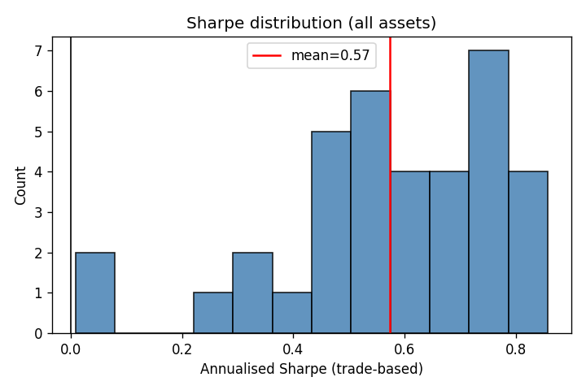
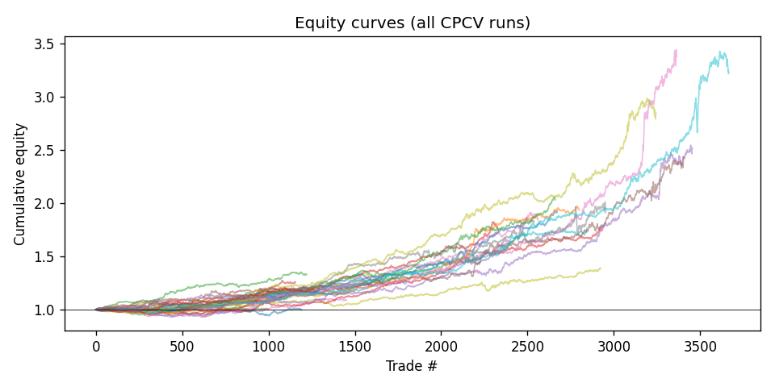
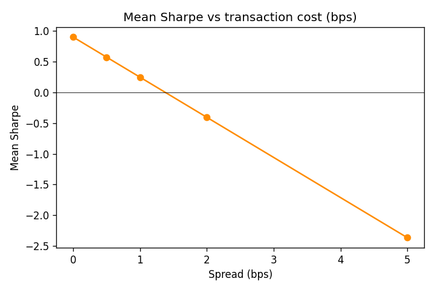

# Evaluation Report

- Runs evaluated: **36**
- Assets: **GC=F**
- Pooled trades: **73658**

## Sharpe distribution (all assets pooled)

- mean   : +0.573
- median : +0.612
- std    : 0.208
- p5     : +0.171
- p95    : +0.825
- min    : +0.009
- max    : +0.857

## Deflated Sharpe Ratio (Bailey & Lopez de Prado, 2014)

- Observed Sharpe (pooled)   : 1.402
- Trials                     : 36
- E[max SR] under null       : 0.126
- PSR vs 0                   : 1.000
- **Deflated SR (P > null)** : **1.000**
- Skewness                   : +0.997
- Excess kurtosis            : +6.937
- Min Track Record Length    : 2.2742295532652834

## Bootstrap 95% CI (block bootstrap)

- Point Sharpe : 1.402
- 2.5% / 97.5% : [1.281, 1.519]  (2000 resamples)

## Monte Carlo permutation test

- One-sided p-value vs random shuffle: **0.986** (lower = more evidence of sequential edge)

## Transaction cost sensitivity

| Cost (bps) | Mean Sharpe |
|-----------:|-------------:|
| 0.0 | +0.900 |
| 0.5 | +0.573 |
| 1.0 | +0.247 |
| 2.0 | -0.406 |
| 5.0 | -2.365 |

## Seed ensemble (pooled trades per split)

### GC=F

| Split | Sharpe |
|------:|-------:|
| 0 | +0.365 |
| 1 | +0.515 |
| 2 | +0.699 |
| 3 | +0.661 |
| 4 | +0.713 |
| 5 | +0.519 |

## Algorithm ensemble (T2.2)

Per-algorithm mean Sharpe across all CPCV splits, seeds, and assets.

| Algorithm | Mean Sharpe | Std | Runs |
|:----------|------------:|----:|-----:|
| grpo | +0.614 | 0.148 | 18 |
| ppo | +0.533 | 0.248 | 18 |

## Cross-asset meta-labeling gate (T1.1, Lopez de Prado)

HistGBM classifier trained on trades from ALL other splits across ALL
assets (cross-asset leave-one-out). Predicts P(profit) from entry
embedding+direction+vol-quantile. Actions with P < threshold are gated.

| Threshold | Mean Sharpe | Pooled Sharpe | Trades | Total Return |
|----------:|------------:|--------------:|-------:|-------------:|
| 0.50 | +4.022 | +3.834 | 27251 | +406264486316022.062 |
| 0.55 | +5.649 | +5.475 | 16802 | +340240898279.087 |
| 0.60 | +7.203 | +7.241 | 9429 | +34402667.229 |

## Red flags

- Permutation p-value > 0.10 (p=0.986)
- Edge collapses at >=5 bps transaction cost

## Plots

- 
- 
- 